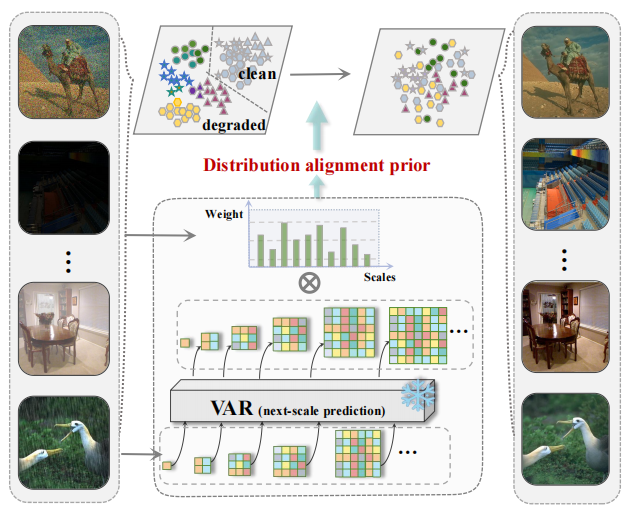

# Navigating Image Restoration with VAR’s Distribution Alignment Prior [](https://arxiv.org/abs/2412.21063v2)&nbsp;

This repository contains the official implementation of the CVPR 2025 poster paper [Navigating Image Restoration with VAR’s Distribution Alignment Prior](https://arxiv.org/abs/2412.21063v2). 
## 🚀 Abstract

>Generative models trained on extensive high-quality datasets effectively capture the structural and statistical properties of clean images, rendering them powerful priors for transforming degraded features into clean ones in image restoration. VAR, a novel image generative paradigm, surpasses diffusion models in generation quality by applying a next-scale prediction approach. It progressively captures both global structures and fine-grained details through the autoregressive process, consistent with the multi-scale restoration principle widely acknowledged in the restoration community. Furthermore, we observe that during the image reconstruction process utilizing VAR, scale predictions automatically modulate the input, facilitating the alignment of representations at subsequent scales with the distribution of clean images. To harness VAR’s adaptive distribution alignment capability in image restoration tasks, we formulate the multi-scale latent representations within VAR as the restoration prior, thus advancing our delicately designed VarFormer framework. The strategic application of these priors enables our VarFormer to achieve remarkable generalization on unseen tasks while also reducing training computational costs.


## 🔥 Data preparing
we refer to  [DiffUIR](https://github.com/iSEE-Laboratory/DiffUIR), the other datasets you could download from [AdaIR](https://github.com/c-yn/AdaIR/blob/main/INSTALL.md) and [DF2K](https://github.com/XPixelGroup/BasicSR/blob/master/docs/DatasetPreparation.md)

- The data structure is like this:
  ```
  dataset
  ├── GoPro
  │  ├── train
  │  ├── test
  ├── LOL
  │  ├── our485
  │  ├── eval15
     ---
  ```

## 🔥Stage 1

Download  [VAR](https://github.com/FoundationVision/VAR) into `experiments/pretrained_models/`

```

python -m torch.distributed.launch --nproc_per_node=gpu_num --master_port=4344 basicsr/pretrain.py -opt basicsr/options/VarFormer_train_stage1.yml --launcher pytorch

```

## 🔥Stage 2

You can train based on stage 1 or just start from scratch. Modify the configuration file `options/VarFormer_train_stage2.yml` accordingly. 

```
python -m torch.distributed.launch --nproc_per_node=gpu_num --master_port=4344 basicsr/train.py -opt basicsr/options/VarFormer_train_stage2.yml --launcher pytorch

```

## 🔥Inference

Modify the configuration file `options/test.yml` accordingly. Download  [VarFormer_16](https://huggingface.co/wsy541/VarFormer/resolve/main/net_g_last.pth) into `experiments/pretrained_models/`

```

python basicsr/varformer_test.py -opt basicsr/options/test.yml

```


## Acknowledgements

This code is built upon [VAR](https://github.com/FoundationVision/VAR) and [CodeFormer](https://github.com/sczhou/CodeFormer), thanks for their excellent work!
